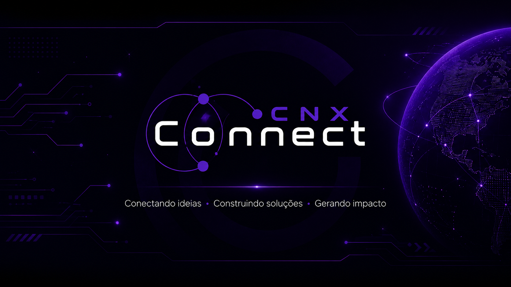

<div align="center">



<br/>
<br/>


</div>

---

## Sobre a CNX Connect

A **CNX Connect** é uma empresa de tecnologia focada em criar soluções digitais modernas, inteligentes e estratégicas.

Nosso objetivo é conectar ideias, negócios e pessoas por meio de desenvolvimento web, automação, inteligência artificial, design e estratégias digitais.

Trabalhamos para transformar necessidades reais em soluções funcionais, escaláveis e visualmente marcantes.

---

## Nossa Essência

> **Conectando ideias. Construindo soluções. Gerando impacto.**

A CNX nasce com o propósito de unir tecnologia, criatividade e estratégia para entregar projetos que geram valor real.

---

## O que fazemos

- Desenvolvimento de sites e landing pages
- Desenvolvimento de sistemas web
- Automações de processos
- Integrações com APIs
- Soluções com Inteligência Artificial
- Dashboards e painéis administrativos
- UI/UX Design
- Marketing digital e presença online
- Estruturação de produtos digitais

---

## Áreas de atuação

<div align="center">

| Desenvolvimento | Automação | Inteligência Artificial |
|---|---|---|
| Sites, sistemas e aplicações web | Fluxos inteligentes e processos automatizados | Assistentes, chatbots e soluções com IA |

| Design & Experiência | Integrações | Estratégia Digital |
|---|---|---|
| Interfaces modernas e funcionais | APIs, ferramentas e plataformas | Posicionamento, campanhas e soluções digitais |

</div>

---

## Tecnologias e Ferramentas

<div align="center">


</div>

---

## Fundadores

<div align="center">

<table>
  <tr>
    <td align="center" width="25%">
      <h3>Marcos Simões</h3>
      <p>Full Stack Developer</p>
      <a href="https://github.com/DevWizardMarcos">
        
      </a>
      <br/>
      <a href="https://www.linkedin.com/in/marcos-simoes-ms/">
        
      </a>
    </td>
    <td align="center" width="25%">
      <h3>Gabriel Souto</h3>
      <p>Full Stack Developer</p>
      <a href="https://github.com/GabrielSouto19">
        
      </a>
      <br/>
      <a href="https://www.linkedin.com/in/gabriel-silva-b91943226/?skipRedirect=true">
        
      </a>
    </td>
    <td align="center" width="25%">
      <h3>Maria Eduarda</h3>
      <p>DevOps Engineer & Cloud Specialist</p>
      <a href="https://github.com/Dudainfinity">
        
      </a>
      <br/>
      <a href="https://www.linkedin.com/in/mariaeduardaengsoftware/?skipRedirect=true">
        
      </a>
    </td>
    <td align="center" width="25%">
      <h3>Pablo Martins</h3>
      <p>Desenvolvedor Full Stack</p>
      <a href="https://github.com/PabloMartins031">
        
      </a>
      <br/>
      <a href="https://www.linkedin.com/in/pablodevfullstack/?skipRedirect=true">
        
      </a>
    </td>
  </tr>
</table>

</div>

---

## Nossos Valores

- **Inovação:** buscamos soluções modernas e eficientes.
- **Conexão:** aproximamos tecnologia, pessoas e negócios.
- **Criatividade:** criamos experiências digitais com identidade.
- **Estratégia:** cada projeto precisa ter propósito e direção.
- **Impacto:** entregamos soluções com valor prático e resultado real.

---

## Projetos

Em breve, esta seção reunirá os principais projetos desenvolvidos pela CNX Connect.

```bash
cnx-connect/
├── websites
├── landing-pages
├── automacoes
├── sistemas-web
├── inteligencia-artificial
└── produtos-digitais
```
